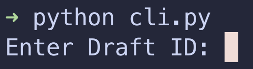

# Sleeper Draft Buddy

A web app and a command-line interface (CLI) tool designed to assist with fantasy football drafts on Sleeper. It provides live draft recommendations based on Underdog Fantasy NFL rankings and real-time draft data from the Sleeper API.

# Web App

TODO

# CLI
### Data Setup

The following steps are required for the application to work:

1. Download the Underdog Fantasy rankings CSV from [underdogfantasy.com/rankings/nfl](https://underdogfantasy.com/rankings/nfl). You will need an Underdog Fantasy account to access this page. It is free to create one, and you do not need to deposit any money to access the rankings.

2. Place the dowloaded CSV file in the data directory at `cli/data/rankings.csv` in the project root. You will need to create the `data/` folder and rename the downloaded CSV to `rankings.csv`.

Now the application will have the ability to recommend draft picks based on these rankings.

### Usage

<ol>
    <li>
        cd into the cli directory with <code>cd cli/</code>.
         
        
    </li>
    <li>
        Start the application with <code>python cli.py</code>.
         
        
    </li>
    <li>
        Enter your Sleeper draft ID. This can be found in your Sleeper draft URL.
         
        
    </li>
    <li>
        You're done! The player suggestions will update every 10 seconds, and will not include any players that have already been picked in the draft.
         
        
    </li>
</ol>

